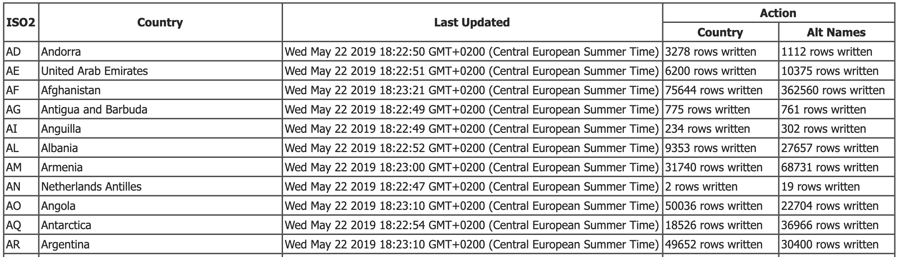

<a name="top"></a>
# geonames\_hana

An NodeJS HTTP server that provides a wide range of geopolitical information available from <http://geonames.org>


## Table of Contents

* [Description](#user-content-description)
* [Requirements](#user-content-requirements)
* [Download](#user-content-download)
* [Initial Deployment](#user-content-initial-deployment)
* [Functionality](#user-content-functionality)
    * [Refreshing The HANA Data](#user-content-refresh-db)
    * [Refresh Period](#user-content-refresh-period)
    * [HANA Write Batch Size](#user-content-batch-size)
* [Data Model](#user-content-datamodel)
* [API](#user-content-api)
* [Limitations](#user-content-limitations)
* [Issues](#user-content-issues)
* [Support](#user-content-support)
* [Contributing](#user-content-contributing)
* [License](#user-content-license)


<!-- *********************************************************************** -->
<a name="description"></a>
## Description

`geonames_hana` is an HTTP server that responds to read-only, RESTful queries and supplies a wide range of geopolitical information from a HANA database.  This data has been imported from <http://geonames.org>

This server is designed for public access, therefore, incoming requests do not require any authentication.  

[Top](#user-content-top)

<!-- *********************************************************************** -->
<a name="requirements"></a>
## Requirements

In order to implement this server, you will need:

1. **A HANA instance**  
    A productive HANA instance is preferable, but a trial HANA instance will suffice.

1. **An HDI container**  
    The default name for this container is `geonames-hdi` but if necessary, you change it by editing lines 21 and 23 of [`mta.yaml`](./mta.yaml)

1. **Access to SAP Web IDE Full-Stack**  
    Web IDE Full-stack must be configured to connect to the Cloud Foundry account in which the above HDI Container lives

[Top](#user-content-top)


<!-- *********************************************************************** -->
<a name="download"></a>
## Download and Installation

Clone this repository into Web IDE Full-Stack

[Top](#user-content-top)


<!-- *********************************************************************** -->
<a name="initial-deployment"></a>
## Initial Deployment

1. **Build and deploy the `/db` folder**  
    This will deploy the CDS data model to your HANA instance and load ***some*** of the tables with static data

1. **Run the `/srv` service to start the server**  
    When this server starts for the very first time, the two main database tables containing the dynamic data will be empty.  To populate (or refresh) these two tables, go to the `/admin` screen and press the "Refresh Server Data" button.  This will download two ZIP files per country from <http://geonames.org> (approximately 500 files), unzip each one, then transfer the tab-delimited text data into the two main database tables:
    * `ORG_GEONAMES_GEONAMES` 
    * `ORG_GEONAMES_ALTERNATENAMES`

### The "No Country" Country

The `ORG_GEONAMES_BASE_GEO_COUNTRIES` table contains one row for each of the 252 countries in the world.  However, there is also a special "no country" country that uses the non-standard ISO code `XX`.

This is a dummy country code and from a technical perspective, is needed to satisfy the foreign key requirements of the data model; however, it is also needed because data is present for geopolitical features that do ***not*** belong to any particular country (such as underwater features in international waters).

Again, to satisfy foreign key requirements, country `XX` has been arbitrarily assigned to continent code `EU` for Europe.

And just to keep you on your toes, the geopolitical data belonging to country `XX` is ***not*** downloaded from the expected `XX.zip` file, but instead from `no-country.zip`.  Consequently, there are several places in the coding where data belonging to country `XX` must be treated as a special case (E.G. In [`srv/loader.js`](./srv/loader.js#L25) or [`srv/admin.html`](./srv/admin.html))

[Top](#user-content-top)


<!-- *********************************************************************** -->
<a name="functionality"></a>
## Functionality

<a name="refresh-db"></a>
### Refreshing The HANA Data

The data in <http://geonames.org> is crowd-sourced and typically changes every day.  Therefore, it is necessary to define a refresh period, after which, the duplicated data in the HANA database must be refreshed.  The refresh is done from the `/admin` page.

As the refresh runs, progress messages will appear in the two right-hand columns of the table shown below.  First, there will be a message saying how many bytes have been unzipped, and then once this data has been processed, the message will change to show the number of rows written to HANA for that particular country.



When loading all the country data into a productive HANA instance, the refresh can take between 15 to 18 minutes to complete; however, if you are using a trial HANA instance, it could take as long as 30 minutes.

***IMPORTANT***  
The GeoNames website does not allow more than about 5 open sockets from the same IP address; hence, all download requests must be grouped into batches of 5.  This is the main reason for why the refresh process takes as long as it does.

Occasionally, the Geonames server will unexpectedly close an open socket, thus killing the server start up process.  If this happens, simply restart the server and restart the synchronisation process

<a name="refresh-period"></a>
### Refresh Period

The refresh period is defined in minutes at the start of file [`srv/config/config_settings.js`](./srv/config/config_settings.js).

```javascript
// DB refresh period in minutes
const refreshFrequency = 1440
```

By default, it is set to 24 hours (1440 minutes).  It is not possible to refresh the data more often than once in any given refresh period.

It is possible however that the data for a certain country has not changed within the last 24 hours.  Therefore, the requests to download a country's ZIP are always made with the `'If-None-Match'` HTTP header field set to the eTag value returned from the last time this ZIP was downloaded.

<a name="batch-size"></a>
### HANA write batch size

By default, when writing data to HANA, table rows are grouped into batches of 20,000.  If needed, the batch size can be changed by altering the value of `hanaWriteBatchSize` at the start of file [`srv/config/config_settings.js`](./srv/config/config_settings.js).

```javascript
// Number of rows to write to HANA in a single batch
const hanaWriteBatchSize = 20000
```

[Top](#user-content-top)


<!-- *********************************************************************** -->
<a name="datamodel"></a>
## Data Model

The CDS data model is derived from the table structure used by <http://geonames.org>.  This geopolitical information is both crowd-sourced and public.

Since the data on <http://geonames.org> is crowd-sourced, it changes regularly.  Consequently, the data in the HANA database will potentially become stale after 24 hours (or 1440 minutes).

From the HTTP server's `/admin` page, you can see a list of all the countries and the timestamp of when each country's data was last refreshed.  Simply hit the "Refresh Server Data" button and as long a gap of at least 1440 minutes has elapsed, the HANA database will be updated from the latest country files available on <http://geonames.org>

Detailed documentation for the data model can be found [here](./docs/datamodel.md)

***IMPORTANT***  
Some of the Geonames data loaded into the HANA database changes so infrequently, that it can be considered static.  Therefore, this data has been hard-coded into `.csv` files within the CDS data model definition.  In the very unlikely event that this data needs to change, then the relevant `.csv` files in the [`db/src/csv`](./db/src/csv) directory must be edited, the CDS model rebuilt and then deployed again to HANA


[Top](#user-content-top)


<!-- *********************************************************************** -->
<a name="api"></a>
## API

The server accepts non-modifying HTTP requests.  Query or read requests will be accepted, but update, delete or create requests will be rejected.

Detailed documentation for the API can be found [here](./docs/api.md)


<!-- *********************************************************************** -->
<a name="limitations"></a>
## Limitations

1. All query string parameter values are `And`'ed together.  
    It is not currently possible to create an API query that uses the `OR` operator across the query string parameters

1. Only one parenthesised value can be specified for a given query string parameter

1. If the server remains running for more than 24 hours (the default refresh period), the data in the database will need to be refreshed.  This is done by visiting the `/admin` page and pressing "Refresh Server Data"

[Top](#user-content-top)


<!-- *********************************************************************** -->
<a name="issues"></a>
## Known Issues

None so far...

:-)

[Top](#user-content-top)


<!-- *********************************************************************** -->
<a name="support"></a>
## Support

This project is provided "as-is": there is no guarantee that raised issues will be answered or addressed in future releases.

[Top](#user-content-top)


<!-- *********************************************************************** -->
<a name="contributing"></a>
## Contributing

Chris Whealy  <chris@whealy.com>

[Top](#user-content-top)


<!-- *********************************************************************** -->
<a name="license"></a>
## License

This project is licensed under the Apache Software License, Version 2.0 except as noted otherwise in the [LICENSE](LICENSE) file.

[Top](#user-content-top)
